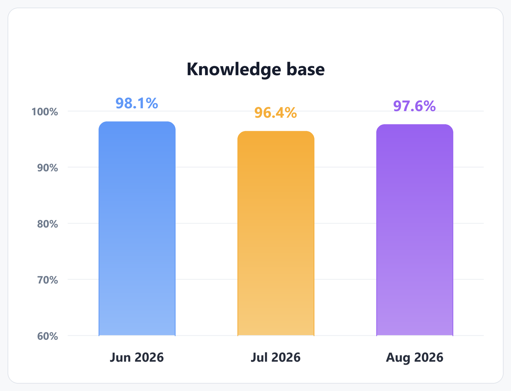

This article tests inline and reference links, autolinks, GFM extended autolinks and images. Each case shows the **Source**, how it **Renders as** in this editor, and what to **Expect**.

Every reference label in this article is unique, because a label applies to the whole page.

## Inline links

### K-01 · Link with and without a title

**Source**

````markdown
[No title](https://example.com) · [Double-quoted title](https://example.com "Title one") · [Single-quoted title](https://example.com 'Title two') · [Parenthesised title](https://example.com (Title three))
````

**Renders as**

[No title](https://example.com) · [Double-quoted title](https://example.com "Title one") · [Single-quoted title](https://example.com 'Title two') · [Parenthesised title](https://example.com (Title three))

**Expect:** four links to example.com. Hovering over the last three shows *Title one*, *Title two* and *Title three*.

<!-- end K-01 -->

### K-02 · Destination in angle brackets

**Source**

````markdown
[Spaces in the destination](<https://example.com/my page>) · [Parentheses in the destination](<https://example.com/a(b)c>)
````

**Renders as**

[Spaces in the destination](<https://example.com/my page>) · [Parentheses in the destination](<https://example.com/a(b)c>)

**Expect:** two links. The first goes to `https://example.com/my%20page`, the second to `https://example.com/a(b)c`.

<!-- end K-02 -->

### K-03 · Balanced parentheses and an empty destination

**Source**

````markdown
[Balanced](https://en.wikipedia.org/wiki/Markdown_(disambiguation)) · [Empty destination]()
````

**Renders as**

[Balanced](https://en.wikipedia.org/wiki/Markdown_(disambiguation)) · [Empty destination]()

**Expect:** the first link keeps `(disambiguation)` in its address. The second is a link with an empty address.

<!-- end K-03 -->

### K-04 · Formatting inside link text

**Source**

````markdown
[**bold**, *italic*, `code` and ~~struck~~ link text](https://example.com)
````

**Renders as**

[**bold**, *italic*, `code` and ~~struck~~ link text](https://example.com)

**Expect:** one link whose text shows all four styles.

<!-- end K-04 -->

### K-05 · Brackets inside link text

**Source**

````markdown
[link [with] brackets](https://example.com) · [escaped \] bracket](https://example.com)
````

**Renders as**

[link [with] brackets](https://example.com) · [escaped \] bracket](https://example.com)

**Expect:** two links, with the text "link [with] brackets" and "escaped ] bracket".

<!-- end K-05 -->

### K-06 · Link to a heading in this article

**Source**

````markdown
[Jump to the images section](#images)
````

**Renders as**

[Jump to the images section](#images)

**Expect:** clicking scrolls to the *Images* heading below.

<!-- end K-06 -->

### K-07 · Relative link to another article

**Source**

````markdown
[GFM 07 · Tables](gfm-07-tables.md) · [Generative AI](../../ai-fundamentals/generative-ai.md)
````

**Renders as**

[GFM 07 · Tables](gfm-07-tables.md) · [Generative AI](../../ai-fundamentals/generative-ai.md)

**Expect:** each link opens that article. On GitHub they open the Markdown files.

<!-- end K-07 -->

## Reference links

### K-08 · Full, collapsed and shortcut references

**Source**

````markdown
[Full reference][k08-full] · [k08 collapsed][] · [k08 shortcut]

[k08-full]: https://example.com/full
[k08 collapsed]: https://example.com/collapsed
[k08 shortcut]: https://example.com/shortcut
````

**Renders as**

[Full reference][k08-full] · [k08 collapsed][] · [k08 shortcut]

[k08-full]: https://example.com/full
[k08 collapsed]: https://example.com/collapsed
[k08 shortcut]: https://example.com/shortcut

**Expect:** three links to `/full`, `/collapsed` and `/shortcut`. The three definition lines are not shown.

<!-- end K-08 -->

### K-09 · Labels ignore case and spacing

**Source**

````markdown
[Case-insensitive][K09 LABEL] · [Extra spaces][k09   label]

[k09 label]: https://example.com/k09 "Reference title"
````

**Renders as**

[Case-insensitive][K09 LABEL] · [Extra spaces][k09   label]

[k09 label]: https://example.com/k09 "Reference title"

**Expect:** both links go to `/k09` and show the title *Reference title* on hover.

<!-- end K-09 -->

### K-10 · Definition before use, and with angle brackets

**Source**

````markdown
[k10-def]: <https://example.com/k10 path> 'Defined first'

[Defined earlier][k10-def]
````

**Renders as**

[k10-def]: <https://example.com/k10 path> 'Defined first'

[Defined earlier][k10-def]

**Expect:** a link to `https://example.com/k10%20path`. The definition line is not shown.

<!-- end K-10 -->

### K-11 · Undefined reference

**Source**

````markdown
[Not defined][k11-missing] · [k11 also missing]
````

**Renders as**

[Not defined][k11-missing] · [k11 also missing]

**Expect:** plain text showing the brackets. No links.

<!-- end K-11 -->

## Autolinks

### K-12 · Angle-bracket autolinks

**Source**

````markdown
<https://example.com> · <mailto:docs@example.com> · <docs@example.com> · <ftp://files.example.com/readme.txt>
````

**Renders as**

<https://example.com> · <mailto:docs@example.com> · <docs@example.com> · <ftp://files.example.com/readme.txt>

**Expect:** four links, shown without the angle brackets. The third opens an email to docs@example.com.

<!-- end K-12 -->

### K-13 · Not autolinks

**Source**

````markdown
<https://example.com/with space> · <example.com> · \<https://example.com>
````

**Renders as**

<https://example.com/with space> · <example.com> · \<https://example.com>

**Expect:** none of the three is an angle-bracket autolink, and every `<` shows as text. GFM extended autolinks (K-14) may still link the bare addresses inside them. Match GitHub's result.

<!-- end K-13 -->

## Extended autolinks (GFM)

### K-14 · www and http links

**Source**

````markdown
Visit www.example.com or https://example.com/path?query=1#top or http://example.com.
````

**Renders as**

Visit www.example.com or https://example.com/path?query=1#top or http://example.com.

**Expect:** three links. The final full stop is not part of the last link.

<!-- end K-14 -->

### K-15 · Trailing punctuation and parentheses

**Source**

````markdown
www.example.com/a?b=c!

(Visit www.example.com/page)

www.example.com/search?q=(business))+ok

www.example.com/a_b_ and www.example.com/a&hl;
````

**Renders as**

www.example.com/a?b=c!

(Visit www.example.com/page)

www.example.com/search?q=(business))+ok

www.example.com/a_b_ and www.example.com/a&hl;

**Expect:** the `!` is not part of the first link. In the second, the closing `)` is not part of the link. In the third, the link ends after `(business))+ok`. In the last line, the links end at `/a_b` and `/a`.

<!-- end K-15 -->

### K-16 · Bare email addresses and protocols

**Source**

````markdown
docs@example.com · first.last+tag@sub.example.co.uk · mailto:help@example.com · xmpp:user@example.com
````

**Renders as**

docs@example.com · first.last+tag@sub.example.co.uk · mailto:help@example.com · xmpp:user@example.com

**Expect:** four links. The first two open an email.

<!-- end K-16 -->

### K-17 · Not extended autolinks

**Source**

````markdown
example.com · www. · `www.example.com` · email@ · a.b-c_d@a.b_
````

**Renders as**

example.com · www. · `www.example.com` · email@ · a.b-c_d@a.b_

**Expect:** no links. The address in the code span stays code.

<!-- end K-17 -->

## Images

### K-18 · Inline image with alt text and title

**Source**

````markdown

````

**Renders as**


**Expect:** a 120 × 40 placeholder image. Hovering shows *Image title*.

<!-- end K-18 -->

### K-19 · Reference image and empty alt text

**Source**

````markdown
![Reference image][k19-img] · 

[k19-img]: https://placehold.co/80x30/png "Reference image title"
````

**Renders as**

![Reference image][k19-img] · 

[k19-img]: https://placehold.co/80x30/png "Reference image title"

**Expect:** two images, 80 × 30 and 60 × 30.

<!-- end K-19 -->

### K-20 · Image as a link

**Source**

````markdown
[](https://example.com)
````

**Renders as**

[](https://example.com)

**Expect:** a 100 × 30 image. Clicking it opens example.com.

<!-- end K-20 -->

### K-21 · Formatting in alt text

**Source**

````markdown

````

**Renders as**


**Expect:** an image whose alt text is the plain text "alt with emphasis and code".

<!-- end K-21 -->

### K-22 · Repository image, two path styles

**Source**

````markdown



````

**Renders as**


**Expect:** the *Knowledge base* bar chart stored in this repository. GitHub shows only the first, because its paths are relative to the file. Document360's own exports use the second style, so note which of the two this editor shows.

<!-- end K-22 -->
